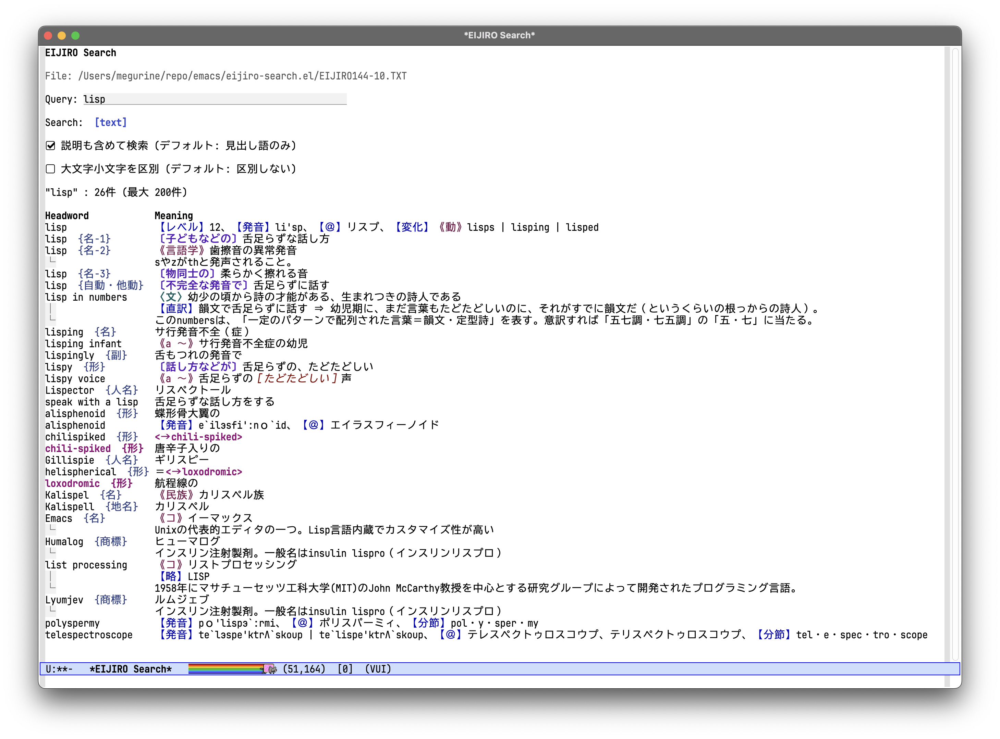

# 📙 eijiro-search.el

This package provides interactive search in GNU Emacs for
the EIJIRO (英辞郎) English-Japanese dictionary, powered by [vui].

<a href="img/screenshot.png"></a>

<div align="right">
<strong><a href="README-ja.md">README (日本語)</a></strong>
</div>

## Requirements

This package requires:

 * **Emacs 29.1** or later
 * [`vui.el`][vui]: A declarative, component-based UI framework for Emacs
 * [ripgrep] (`rg`) command
 * UTF-8 converted `EIJIRO144-10.TXT` (see below)

> [!NOTE]
> Since vui.el is distributed on MELPA, make sure [MELPA]
> is added to your `package-archives` in your Emacs configuration.

## Installation

You can install `eijiro-search` with `package-vc-install`
(available in Emacs 29.1 and later) by evaluating:

```elisp
(package-vc-install
 '(eijiro-search :url "https://github.com/zonuexe/eijiro-search.el.git"
                 :main-file "eijiro-search.el"))
```

Set the dictionary file in your [Emacs init file] (`init.el`):

```elisp
(with-eval-after-load 'eijiro-search
  (setopt eijiro-search-dictionary-file
          (expand-file-name "~/path/to/dict-dir/EIJIRO144-10.TXT")))

;; If you use use-package, you can also write:
(use-package eijiro-search
  :defer t
  :custom
  (eijiro-search-dictionary-file
   (expand-file-name "~/path/to/dict-dir/EIJIRO144-10.TXT")))
```

## About the Data

This package searches data for [EIJIRO Ver.144.10][EIJIRO-144], sold by [EDP].

> [!WARNING]
> This is different from [EIJIRO on the WEB], provided by [ALC PRESS].

After downloading your purchased data, convert the encoding from **Shift_JIS (CP932) / CR+LF** to **UTF-8 / LF**.

```sh
cd ~/path/to/dict-dir
EIJIROFILE=~/Downloads/EIJIRO144-10.TXT
if command -v nkf >/dev/null
then nkf -Lu -w80 "$EIJIROFILE"
else iconv -f CP932 -t UTF-8 "$EIJIROFILE" | tr -d '\r'
fi | tee EIJIRO144-10.TXT | sha256sum
```

If conversion succeeds, the message digests should be:

 * `nkf -Luw80 ~/Downloads/EIJIRO144-10.TXT`
   * SHA-256: `7be6cbec1809012b8c247965d1ab71d3a57a12804a61e36496f55bd76e31af54`
 * `iconv -f UTF-8 -t UTF-8 | tr -d '\r'`
   * SHA-256: `be84db914dbad6812d05272280eca296d77ad0733e7d905ba39476b417e49f33`

> [!NOTE]
> `nkf` and `iconv` differ in how they map `U+2014 EM DASH` and `U+2015 HORIZONTAL BAR`, so their digests are not identical.
>
> The differences are only these two records, and there is no practical issue whether you use `nkf` or `iconv`:
>
> ```diff
> --- nkf.txt
> +++ iconv.txt
> -■Angel of Death  {映画} : 要塞帝国—SS最終指令◆米1986年
> +■Angel of Death  {映画} : 要塞帝国―SS最終指令◆米1986年
> -■Japanese Society of Human-Environment System  {組織} : 人間—生活環境系学会◆【略】HES◆【URL】http://www.jhes-jp.com/jp/
> +■Japanese Society of Human-Environment System  {組織} : 人間―生活環境系学会◆【略】HES◆【URL】http://www.jhes-jp.com/jp/
> ```

## FAQ

### Will this support newer EIJIRO releases?

It has been officially stated that [EIJIRO Ver.144.10][EIJIRO-144] (revised on April 7, 2024) is the final release for text-format sales.

> * Ver.144.10 is not the newest release, but all known errors found through April 7, 2024 were fixed.
> * There are no plans to sell Ver.145+ in text format, or in formats convertible to text (such as EPWING), due to misuse of text-format data.

Because off-purpose use of currently sold, encrypted latest digital data is prohibited, there are no plans to support them.

## Copyright

This package is released under [GPLv3]. See [`LICENSE`](LICENSE) file.

> Copyright (C) 2026  USAMI Kenta
>
> This program is free software; you can redistribute it and/or modify
> it under the terms of the GNU General Public License as published by
> the Free Software Foundation, either version 3 of the License, or
> (at your option) any later version.
>
> This program is distributed in the hope that it will be useful,
> but WITHOUT ANY WARRANTY; without even the implied warranty of
> MERCHANTABILITY or FITNESS FOR A PARTICULAR PURPOSE.  See the
> GNU General Public License for more details.
>
> You should have received a copy of the GNU General Public License
> along with this program.  If not, see <https://www.gnu.org/licenses/>.

### EIJIRO

Please use the dictionary data in accordance with the [EIJIRO Terms of Use][EIJIRO-terms] and the "Terms of Sale and Use" (`販売条件および使用条件`) section on the product page.

***Allowing third parties to use purchased data is prohibited.***

`eijiro-search.el` is developed independently from the EIJIRO data author (EDP).
Please do not contact the data author about how to use this package.

[ALC PRESS]: https://www.alc.co.jp/
[EDP]: https://www.eijiro.jp/
[EIJIRO on the WEB]: https://eow.alc.co.jp/
[EIJIRO-144]: https://www.eijiro.jp/get-144.htm
[EIJIRO-terms]: https://www.eijiro.jp/kiyaku.htm
[Emacs init file]: https://www.gnu.org/software/emacs/manual/html_node/emacs/Init-File.html
[GPLv3]: https://www.gnu.org/licenses/gpl-3.0.html
[MELPA]: https://melpa.org/#/getting-started
[ripgrep]: https://github.com/BurntSushi/ripgrep
[vui]: https://github.com/d12frosted/vui.el
